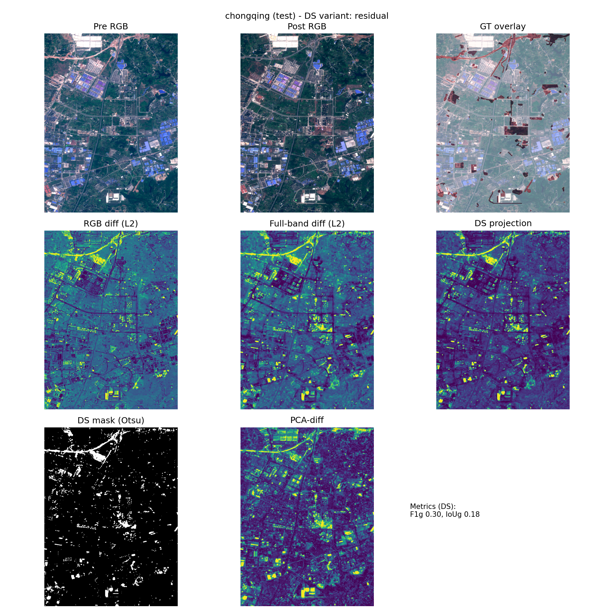
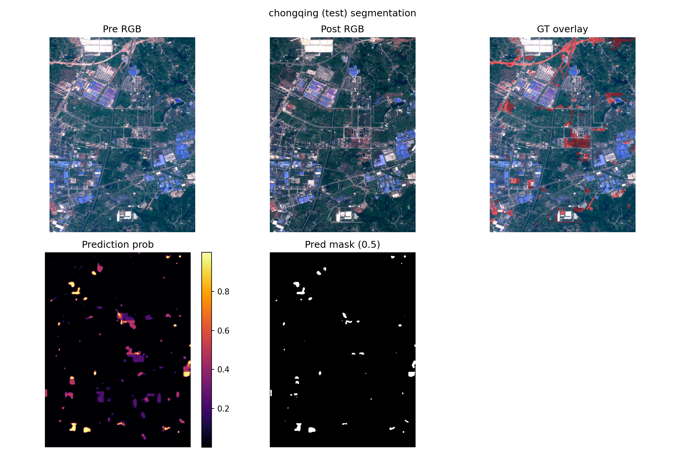
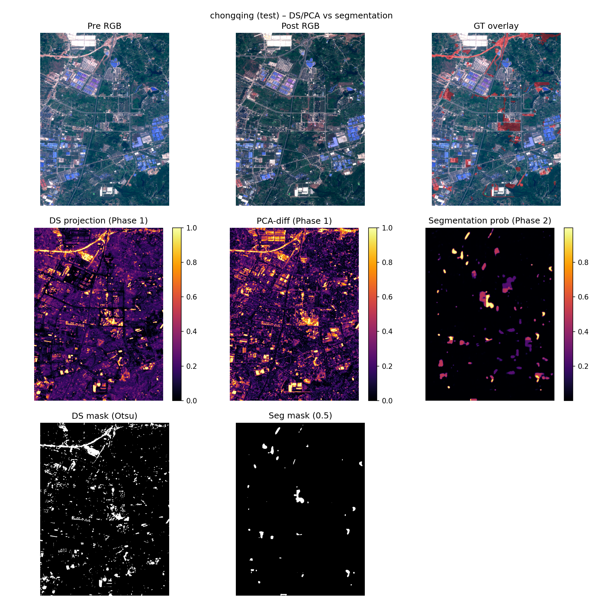

# DS_damage_segmentation – Difference‑Subspace Priors for Change & Damage Segmentation

<p align="center">
  
  
  
</p>

End‑to‑end research code for **Difference‑Subspace (DS)** change detection and
**segmentation with DS / PCA‑diff priors** on Sentinel‑2 imagery.

The project is organized in phases:

- **Phase 1 – DS + classical change detection (OSCD + MultiSenGE)**  
  Unsupervised change scores on Sentinel‑2 using DS and baselines
  (pixel diff, CVA, PCA‑diff, Celik, IR‑MAD). Outputs are change maps,
  metrics and per‑city visualization figures.

- **Phase 2 – OSCD segmentation with DS / PCA‑diff priors**  
  Supervised U‑Net / ResNet segmentation on OSCD, using raw S2 bands and
  Phase‑1 change maps (DS, PCA‑diff, etc.) as optional priors. Outputs
  are segmentation models, metrics, and interpretability figures that
  compare priors vs predictions.

Phase 3 (future) will adapt the same machinery to a damage‑labeled
dataset (e.g. xBD / xBD‑S12).

---

## 1. Repository layout

From the repo root `DS_damage_segmentation/`:

- `phase1/` – Phase‑1 DS and classical change detection.
  - `configs/` – OSCD / MultiSenGE configs (DS variant, baselines).
  - `ds/` – PCA/subspace utilities and DS scoring (`DSConfig` etc.).
  - `baselines/` – pixel diff, CVA, PCA‑diff, Celik, IR‑MAD.
  - `data/` – OSCD / MultiSenGE loaders and preprocessing utilities.
  - `eval/` – metrics, thresholding, OSCD eval + MultiSenGE viz CLIs.
  - `docs/` – Phase‑1 spec and report (research‑level detail).
  - `outputs/` – Phase‑1 results (git‑ignored; recomputable).

- `phase2/` – Phase‑2 OSCD segmentation with priors.
  - `configs/` – OSCD segmentation configs:
    - U‑Net raw only / raw+priors.
    - ResNet‑U‑Net baselines.
    - PriorsFusionUNet (two‑branch fusion).
  - `data/` – OSCD segmentation dataset + transforms.
  - `models/` – `UNet2D`, `UNet2DResNetBackbone`, `PriorsFusionUNet`.
  - `train/` – training loop, losses, optimizers, callbacks.
  - `eval/` – segmentation metrics, evaluation, priors‑ablation script.
  - `viz/` – segmentation viz + combined DS/PCA + segmentation figs.
  - `docs/` – Phase‑2 spec and report (+ run guide).
  - `outputs/` – Phase‑2 models, evals, and figures (git‑ignored).

- `reference_code/` – DS/Subspace toolbox and lab reference code
  (includes large `.mat` files; kept local and git‑ignored).

- `research-notes/` – separate notes repo (not tracked here) with math
  appendices and planning.

Key documentation:

- Phase 1:
  - `phase1/docs/spec_phase1_ds_oscd.md` – detailed Phase‑1 spec.
  - `phase1/docs/phase1_report.md` – full Phase‑1 report.
  - `phase1/docs/phase1_run_guide.md` – **how to run Phase 1**.
- Phase 2:
  - `phase2/docs/spec_phase2_oscd_seg.md` – detailed Phase‑2 spec.
  - `phase2/docs/phase2_report.md` – full Phase‑2 report + results.
  - `phase2/docs/phase2_run_guide.md` – **how to run Phase 2**.

---

## 2. Installation

Requirements: Python ≥3.9 and a recent PyTorch + CUDA stack.

From the repo root:

```bash
python -m venv .venv_phase2          # or conda create ...
source .venv_phase2/bin/activate     # Windows: .venv_phase2\Scripts\activate

pip install -r phase1/requirements.txt
pip install -r phase2/requirements.txt
```

The `requirements.txt` files include `rasterio`, `torch`, `torchvision`,
`numpy`, `matplotlib`, etc.

Data:

- OSCD root expected at `phase1/data/raw/OSCD` (see Phase‑1 spec for
  exact structure).
- MultiSenGE S2 root (optional for Phase‑1 viz) goes under
  `phase1/data/raw/MultiSenGE/...` as configured in
  `phase1/configs/multisenge_default.yaml`.

---

## 3. Phase 1 – DS & Baselines (OSCD + MultiSenGE)

### 3.1 Goals

- Implement **Difference‑Subspace (DS)** change detection for Sentinel‑2.
- Compare DS to classical unsupervised baselines:
  pixel diff, CVA, PCA‑diff, Celik (local PCA+k‑means), IR‑MAD.
- Evaluate quantitatively on **OSCD** (AUROC, IoU, F1, etc.).
- Visualize DS behavior qualitatively on **MultiSenGE**.

DS computes subspaces for pre/post spectra, builds a **difference
subspace**, and scores pixels by projection into that subspace and
cross‑residual. PCA‑diff and other baselines give complementary views.

### 3.2 OSCD evaluation (DS + baselines)

From `phase1/`:

```bash
cd phase1
python -m eval.run_oscd_eval \
  --config configs/oscd_default.yaml \
  --oscd_root data/raw/OSCD \
  --output_dir outputs/oscd_saved \
  --save_change_maps \
  --disable_celik        # optional speed-up
```

This runs DS and baselines on the official OSCD splits and writes:

- `outputs/oscd_saved/oscd_eval_results.json`
- `outputs/oscd_saved/oscd_eval_summary.csv`
- `outputs/oscd_saved/oscd_change_maps/{split}/{method}/{city}_score.npy`

These `*_score.npy` files are **Phase‑2 priors** (`ds_projection`,
`pca_diff`, etc.).

### 3.3 MultiSenGE DS visualization

From `phase1/`:

```bash
python -m eval.run_multisenge_viz \
  --config configs/multisenge_default.yaml \
  --output_dir outputs/multisenge_ds_viz
```

This produces DS projection maps (PNG + GeoTIFF) for many S2
patches, useful for understanding what DS responds to beyond OSCD.

### 3.4 Phase‑1 example figures

Typical OSCD per‑city figure (created by
`phase1/eval/visualize_oscd_examples.py`):

```bash
python -m eval.visualize_oscd_examples \
  --config configs/oscd_default.yaml \
  --oscd_root data/raw/OSCD \
  --output_dir outputs/oscd_figs_all \
  --cities chongqing \
  --metrics_json outputs/oscd_saved/oscd_eval_results.json
```

Example figure (tracked in this repo):


This 3×3 figure shows:

- Pre RGB, Post RGB, GT overlay.
- RGB L2 diff, full‑band diff.
- DS projection, DS mask (Otsu), PCA‑diff + metrics.

---

## 4. Phase 2 – OSCD Segmentation with DS / PCA‑diff Priors

### 4.1 Goals

- Move from **unsupervised change scores** (Phase 1) to supervised **binary
  change segmentation** on OSCD.
- Compare different **feature paths**:
  - Raw S2 only (pre+post).
  - Raw S2 + DS prior.
  - Raw S2 + PCA‑diff prior.
  - Raw S2 + DS + PCA‑diff.
  - Priors‑only sanity checks.
- Analyze when DS/PCA priors help / hurt, and use them for
  explainability even when raw‑only performs best.

### 4.2 Core experiments and configs

Configs live in `phase2/configs/`:

- U‑Net:
  - `oscd_seg_baseline.yaml` – E0: raw only.
  - `oscd_seg_E1_raw_ds.yaml` – E1: raw + DS.
  - `oscd_seg_E2_raw_pca.yaml` – E2: raw + PCA‑diff.
  - `oscd_seg_priors.yaml` – E3: raw + DS + PCA‑diff.
- ResNet‑U‑Net:
  - `oscd_seg_baseline_resnet.yaml` – raw only.
  - `oscd_seg_priors_resnet.yaml` – raw + DS + PCA‑diff.
- PriorsFusionUNet:
  - `oscd_seg_priors_fusion.yaml` – raw + DS + PCA‑diff with separate
    raw/prior branches.

### 4.3 Training examples

From `phase2/`:

**U‑Net raw only (E0)**

```bash
cd phase2
python -m train.train_oscd_seg \
  --config configs/oscd_seg_baseline.yaml \
  --oscd_root ../phase1/data/raw/OSCD \
  --phase1_change_maps_root ../phase1/outputs/oscd_saved/oscd_change_maps \
  --output_dir outputs/oscd_seg_E0_raw
```

**U‑Net raw + DS + PCA‑diff (E3)**

```bash
cd phase2
python -m train.train_oscd_seg \
  --config configs/oscd_seg_priors.yaml \
  --oscd_root ../phase1/data/raw/OSCD \
  --phase1_change_maps_root ../phase1/outputs/oscd_saved/oscd_change_maps \
  --output_dir outputs/oscd_seg_E3_raw_ds_pca
```

**ResNet‑U‑Net raw only**

```bash
cd phase2
python -m train.train_oscd_seg \
  --config configs/oscd_seg_baseline_resnet.yaml \
  --oscd_root ../phase1/data/raw/OSCD \
  --phase1_change_maps_root ../phase1/outputs/oscd_saved/oscd_change_maps \
  --output_dir outputs/oscd_seg_E0_raw_resnet
```

**PriorsFusionUNet (raw + DS + PCA‑diff)**

```bash
cd phase2
python -m train.train_oscd_seg \
  --config configs/oscd_seg_priors_fusion.yaml \
  --oscd_root ../phase1/data/raw/OSCD \
  --phase1_change_maps_root ../phase1/outputs/oscd_saved/oscd_change_maps \
  --output_dir outputs/oscd_seg_E3_raw_ds_pca_fusion
```

You can set `--max_epochs` to a small number (e.g. 2) for quick sanity
checks before full runs.

For more detailed run recipes (including longer training and multiple
seeds) see `phase2/docs/phase2_run_guide.md`.

### 4.4 Evaluation

Script: `phase2/eval/evaluate_oscd_seg.py`.

Example (E0 U‑Net raw only):

```bash
cd phase2
python -m eval.evaluate_oscd_seg \
  --config configs/oscd_seg_baseline.yaml \
  --oscd_root ../phase1/data/raw/OSCD \
  --phase1_change_maps_root ../phase1/outputs/oscd_saved/oscd_change_maps \
  --checkpoint outputs/oscd_seg_E0_raw/best.ckpt \
  --output_dir outputs/oscd_seg_E0_raw_eval
```

Outputs:

- `oscd_seg_eval_results.json` – per‑city metrics.
- `oscd_seg_eval_summary.csv` – split‑level mean IoU/F1/AUROC.

`phase2/eval/compare_priors_effect.py` can then aggregate multiple runs
into a small priors‑ablation table (e.g. raw vs raw+DS vs raw+PCA vs
raw+DS+PCA).

### 4.5 Segmentation and combined DS/PCA figures

**Per‑city segmentation summaries** (`viz_seg_predictions.py`):

```bash
cd phase2
python -m viz.viz_seg_predictions \
  --config configs/oscd_seg_baseline_resnet.yaml \
  --oscd_root ../phase1/data/raw/OSCD \
  --phase1_change_maps_root ../phase1/outputs/oscd_saved/oscd_change_maps \
  --checkpoint outputs/oscd_seg_E0_raw_resnet/best.ckpt \
  --output_dir outputs/oscd_seg_figs_E0_resnet \
  --cities test
```

Produces per‑city PNGs such as:

```text
phase2/outputs/oscd_seg_figs_E0_resnet/chongqing_seg_summary.png
```

Tracked preview:


Each shows Pre RGB, Post RGB, GT overlay, prob map, and mask.

**Combined DS/PCA + segmentation figures** (`viz_oscd_combined.py`):

ResNet raw‑only:

```bash
cd phase2
python -m viz.viz_oscd_combined \
  --config configs/oscd_seg_baseline_resnet.yaml \
  --oscd_root ../phase1/data/raw/OSCD \
  --phase1_change_maps_root ../phase1/outputs/oscd_saved/oscd_change_maps \
  --checkpoint outputs/oscd_seg_E0_raw_resnet/best.ckpt \
  --output_dir outputs/oscd_combined_resnet \
  --cities test
```

PriorsFusionUNet:

```bash
cd phase2
python -m viz.viz_oscd_combined \
  --config configs/oscd_seg_priors_fusion.yaml \
  --oscd_root ../phase1/data/raw/OSCD \
  --phase1_change_maps_root ../phase1/outputs/oscd_saved/oscd_change_maps \
  --checkpoint outputs/oscd_seg_E3_raw_ds_pca_fusion/best.ckpt \
  --output_dir outputs/oscd_combined_fusion \
  --cities test
```

Each combined figure (e.g.
`phase2/outputs/oscd_combined_resnet/brasilia_combined_summary.png`)
shows:

- Row 1: Pre RGB, Post RGB, GT overlay.
- Row 2: DS projection, PCA‑diff, segmentation probability.
- Row 3: DS mask (Otsu), segmentation mask (0.5).

These are key for telling the DS‑centric story: they show where the
segmentation model agrees with priors and GT, and where it diverges
(e.g., DS‑strong but GT‑negative vegetation changes).

Tracked preview:


---

## 5. Results at a glance (OSCD)

On the OSCD test split (numbers approx.; see
`phase2/docs/phase2_report.md` and CSVs for exact values):

- **U‑Net (raw only)**:
  - mean IoU ≈ 0.23, F1 ≈ 0.33, AUROC ≈ 0.86.
- **U‑Net (raw + DS / PCA‑diff)**:
  - Simple concatenation of priors does **not** improve IoU/F1; AUROC
    may move slightly up or down depending on the path.
- **ResNet‑U‑Net (raw only)**:
  - Similar IoU/F1 to U‑Net but with stronger per‑city performance on
    some tiles.
- **ResNet / PriorsFusionUNet with priors**:
  - PriorsFusionUNet can slightly improve AUROC over naive
    concatenation, but still lags raw‑only in IoU/F1 due to extra
    DS‑driven false positives.

Overall:

- **Raw S2 segmentation** is the strongest baseline on OSCD in IoU/F1.
- **DS/PCA‑diff priors** are:
  - Informative and interpretable as unsupervised spectral change
    detectors.
  - Useful for explainability and as a bridge toward damage datasets
    (Phase 3).

---

## 6. Future experiments and Phase 3

The Phase‑2 report (`phase2/docs/phase2_report.md`, Section 7) lists
several next‑step ideas, including:

- **Longer training and more seeds** for key configs (E0/E3, ResNet
  baselines) with 100–150 epochs.
- **ImageNet pretraining** for the ResNet encoder (`pretrained: true`)
  and comparison vs the current runs.
- **MultiSenGE pseudo‑label pretraining** (regress DS/PCA‑diff maps on a
  large unlabeled corpus, then fine‑tune on OSCD).
- **More advanced use of priors**: loss weighting, spatially adaptive
  thresholds, mid‑layer feature injection in PriorsFusionUNet.

Phase 3 will reuse the Phase‑2 architecture and priors machinery, but
swap in a damage dataset via a small adapter class and new configs.

---

## 7. Reproducibility and large files

- `phase1/outputs/` and `phase2/outputs/` are **git‑ignored** to avoid
  pushing large checkpoints and change maps; all figures and metrics can
  be regenerated with the commands above.
- Large reference `.mat` data for the Subspace toolbox lives under
  `reference_code/` and is also git‑ignored; it is used only to
  sanity‑check DS behavior against lab implementations.
- If you want figures to appear directly on GitHub, you can copy a small
  curated subset of PNGs (e.g., OSCD and combined DS/PCA summaries)
  into a tracked folder (such as `phase2/docs/figs/`) and update the
  image paths in this README accordingly.

For full methodological details and ablation results, see:

- Phase 1: `phase1/docs/phase1_report.md`
- Phase 2: `phase2/docs/phase2_report.md`

These, together with the run guides, are the main handoff documents for
anyone extending this repo (including a future Phase‑3 assistant).
